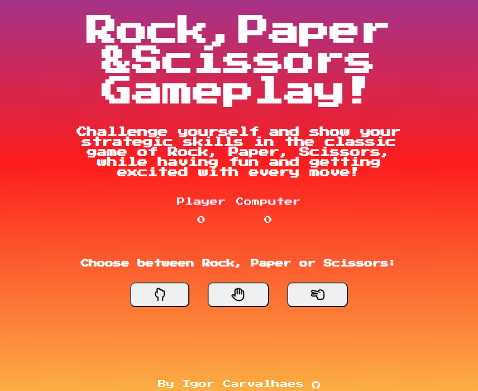

# Rock-Paper-Scissors Game

Welcome to the **Rock-Paper-Scissors Game**, a fun and interactive project inspired by The Odin Project! Challenge yourself against the computer in this classic game of strategy and luck. Now featuring a fully responsive design for an enhanced gaming experience on any device!

## Overview

This project is a digital rendition of the timeless game, Rock, Paper, Scissors. You and the computer will engage in a series of rounds, each choosing one of the three options: Rock, Paper, or Scissors. The game keeps track of the score and declares the winner after five rounds.

## Features

- **Interactive UI:** Enjoy a visually appealing and user-friendly interface that enhances your gaming experience.
- **Real-Time Scoring:** Keep track of the score after each round to see who's leading.
- **Responsive Design:** Play seamlessly on any device, whether it's a desktop, tablet, or smartphone.
- **Winner Declaration:** After five rounds, the game announces the overall winner based on the scores.

## How to Play

1. **Start the Game:** Open the game in your browser.
2. **Make Your Choice:** Click on Rock, Paper, or Scissors to make your move.
3. **Round Results:** The computer will randomly choose its move, and the result of the round will be displayed.
4. **Score Tracking:** The score counter will update to show the current standing.
5. **End of Game:** After five rounds, the game will announce the winner based on the accumulated scores.

## Getting Started

1. **Clone the Repository:**
   ```sh
   git clone https://github.com/yourusername/rock-paper-scissors.git
   ```
2. **Navigate to the Project Directory:**
   ```sh
   cd rock-paper-scissors
   ```
3. **Open the Game:**
   Open the `index.html` file in your preferred web browser.

## Screenshots



## Technologies Used

- HTML
- CSS
- JavaScript

## Contributing

Contributions are welcome! Feel free to open issues or submit pull requests with improvements.

## Acknowledgements

- [The Odin Project](https://www.theodinproject.com) for the inspiration and guidance.

Enjoy the game and may the best player win!
